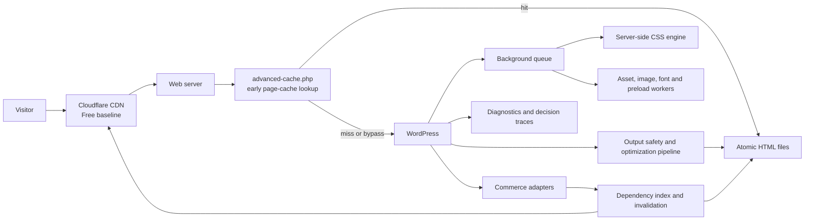

# GT Performance: Product and Technical Plan

## 1. Product Decision

GT Performance will be a modular WordPress performance plugin with four defining strengths:

1. Fast, safe page caching at WordPress and Cloudflare.
2. Server-side CSS optimization with flexible delivery.
3. First-class commerce safety for FluentCart, Easy Digital Downloads, and WooCommerce.
4. A diagnostic layer that explains every cache and optimization decision.

Version 1.0 should reach practical feature parity with the documented FlyingPress feature set while going further in cache observability, Cloudflare Free integration, commerce correctness, rollback safety, dependency-aware purging, staged rollout, and performance regression detection.

Feature parity means independently implementing documented behavior. It does not mean copying proprietary code, user interface, copy, or internal protocols.

## 2. Product Principles

- **Correctness before hit rate.** A cached private cart, receipt, or account page is a release-blocking security defect.
- **Cloudflare Free first.** The normal setup must work without APO, Workers, Argo, Cache Reserve, Enterprise cache tags, or a paid Cloudflare subscription.
- **Fast defaults, reversible changes.** Every generated file, drop-in, server rule, and Cloudflare rule has ownership metadata, a backup, and a rollback path.
- **Server-side optimization.** Core CSS analysis and generation run on infrastructure controlled by the site owner. No external optimizer is required.
- **No invisible breakage.** Failed parsing, validation, storage, or background work falls back to the original page and assets.
- **Targeted invalidation.** Purge what changed and its real dependencies; avoid “purge everything” as the normal path.
- **Measure before claiming.** The dashboard reports origin cache time, edge status, queue health, and optimization savings from plugin-owned operations.
- **Low dynamic overhead.** Disabled modules do not register frontend work. Administrative and queue code do not load during normal public requests.
- **Interoperable by design.** Detect host caches, existing drop-ins, CDNs, multilingual plugins, currency plugins, membership plugins, and commerce state before enabling aggressive settings.

## 3. Supported Platform

Draft baseline:

- WordPress 6.6 or newer.
- PHP 8.1 or newer.
- Single site at first alpha; multisite supported before 1.0.
- Apache, Nginx, OpenLiteSpeed/LiteSpeed, and PHP fallback delivery.
- Standard filesystem, Redis where available, and read-only filesystem detection.
- Cloudflare proxied DNS for edge-page caching; the plugin remains useful without Cloudflare.

The PHP and WordPress minimums must be finalized before implementation begins.

## 4. Feature Parity and GT Extensions

| Capability | Version 1.0 parity target | GT Performance extension |
|---|---|---|
| Page cache | Static HTML cache, exclusions, lifespan, mobile and role variants | Atomic writes, request coalescing, stale-on-error, signed bypass, per-request decision trace |
| Cache preload | Sitemap/discovery queue and post-change preload | Priority queue, CPU/load budgets, dependency-aware warming, WP-CLI runner |
| Purging | Page, related archives, and full purge | Dependency graph, purge coalescing, multi-layer readback, automatic rollback on mismatch |
| Query policy | Ignore, bypass, or separate cache by query parameter | Marketing-parameter normalization, allowlist policy, conflict simulator |
| Cookie policy | Bypass and separate variants | Commerce adapter registry, privacy audit, exact cookie-name matching |
| Logged-in cache | Optional role-specific variants | Explicit risk gate, capability-aware profiles, private-response validator |
| CSS | Minify and remove unused CSS | Server-side engine, file/inline/hybrid delivery, template fingerprints, coverage validation |
| JavaScript | Minify, defer, delay, interaction loading | Dependency graph, consent-aware loading, per-script diagnostics, safe-mode rollback |
| Third-party assets | Self-host selected CSS/JS | Integrity validation, refresh policy, SSRF controls, license/source metadata |
| Images | Lazy load, dimensions, responsive sizing, compression, WebP/AVIF | Local processing, media-level restore, content-addressed variants, optional Cloudflare Images |
| Critical resources | Preload important images and fonts | Evidence-based priority hints, budget enforcement, duplicate-preload detection |
| Video/iframe | Lazy loading and lightweight YouTube previews | Privacy-enhanced mode, local thumbnails, consent-aware embeds |
| Fonts | Preload and self-host Google Fonts | Optional subsetting, unicode-range generation, duplicate/font-display audit |
| Lazy render | Defer offscreen elements | Per-selector preview, accessibility exceptions, interaction-safe reveal |
| Database | Cleanup and scheduled maintenance | Dry run, backup manifest, size forecast, per-table audit trail |
| WordPress bloat | Heartbeat/revision and common frontend controls | Risk labels, role/context rules, conflict detection |
| Object cache | Redis integration | Drop-in ownership, health metrics, prefix isolation, safe flush semantics |
| Cloudflare | Full-page cache and synchronized purge/bypasses | Free-plan-first one-rule setup, drift detection, reversible rules, capability tiers |
| WooCommerce | Core dynamic-page exclusions and product purges | Full Store API/session coverage, dependency purge, checkout E2E suite |
| EDD | Manual compatibility in competitor product | First-class pages, cookies, discounts, recovery, purchase-flow adapter |
| FluentCart | Manual compatibility in competitor product | First-class pages, REST/AJAX/cart hash, instant checkout, receipt safety |
| Diagnostics | Basic cache status | Explain-why trace, headers, CLI doctor, configuration drift and conflict reports |
| Rollout safety | Manual enable/disable | Preview mode, URL cohorts, staged percentage rollout, automatic fault circuit breaker |

## 5. High-Level Architecture

### 5.1 WordPress bootstrap

- One lightweight plugin bootstrap.
- PSR-4 namespaces under `GTPerformance`.
- Service container or explicit module registry compiled once per request.
- Admin, REST, CLI, cron, and frontend modules loaded only in their contexts.
- Feature flags stored as a versioned settings document.
- Migrations are idempotent and never run on public requests.

### 5.2 Early page-cache drop-in

- A plugin-owned `advanced-cache.php` performs eligibility checks before full WordPress bootstrap.
- It refuses installation when another owner controls the drop-in unless the administrator explicitly migrates.
- The original drop-in and `WP_CACHE` state are backed up and restorable.
- Cache files are content-addressed or deterministically keyed, written to a temporary file, verified, then atomically renamed.
- Gzip/Brotli variants are optional and must retain correct `Content-Type`, `Content-Encoding`, `Vary`, and body behavior.
- A PHP cache handler is available where rewrite-based serving is incompatible.

### 5.3 Storage

- Page files: `wp-content/cache/gt-performance/pages/`.
- Generated assets: `wp-content/cache/gt-performance/assets/`.
- Logs: bounded, redacted, disabled by default in production.
- WordPress options: small settings only, non-autoloaded unless required on every request.
- Custom tables:
  - queue/jobs;
  - cache/dependency index;
  - optimization fingerprints and artifacts.
- All tables include a schema version and bounded cleanup policy.

### 5.4 Background queue

- Lightweight database queue with explicit states, leases, retry counts, and dead-letter status.
- WP-Cron runner for basic hosts.
- Real cron, WP-CLI daemon, and loopback runners for stronger hosts.
- CPU, memory, time, and concurrency budgets.
- Idempotency keys prevent duplicate optimization or purge storms.
- Admin requests enqueue work but do not perform expensive CSS/image/preload processing inline.

## 6. Page-Cache Contract

### 6.1 Eligibility

A response is cacheable only when all conditions pass:

- Request method is `GET` or `HEAD`.
- Host, scheme, port, and canonical path are expected.
- Request is not an authenticated, preview, nonce-bearing, REST, AJAX, cron, feed, search, admin, or explicitly dynamic request.
- No configured bypass cookie, header, query parameter, role, route, or commerce predicate matches.
- Response status and content type are cacheable.
- Response does not contain private/no-store directives, unsafe `Set-Cookie`, personalization markers, password protection, or a plugin veto.
- Output validation recognizes an HTML document and completes without fatal errors.

Every rejection records a machine-readable reason code when debug mode is enabled.

### 6.2 Cache key

The default key includes:

- canonical scheme, host, path, and trailing-slash policy;
- an explicit allowlist of meaningful query parameters;
- optional device, language, currency, role, or cookie variants only when enabled;
- site/blog ID in multisite;
- configuration generation.

Known marketing parameters are ignored by default. Unknown parameters bypass cache until classified; they do not silently create unbounded variants.

### 6.3 Freshness and stale behavior

- Browser TTL and shared/edge TTL are separate.
- Cached HTML supports a short fresh window plus configurable stale-while-revalidate and stale-if-error windows.
- WordPress cache refresh uses a lock so one process regenerates while eligible visitors receive the prior safe copy.
- A failed regeneration never deletes the last known-good page.
- Hard expiry is available for legally or operationally sensitive pages.

### 6.4 Invalidation

The dependency index maps a changed entity to:

- canonical post/product/download URL;
- home/blog/shop pages;
- taxonomy, author, date, and post-type archives;
- paginated archive URLs;
- feeds and sitemaps when relevant;
- navigation or block-query consumers;
- related products/content;
- language/currency/device variants;
- Cloudflare cache keys or purge URLs.

Events are coalesced into a short purge window. Full purge is reserved for theme/plugin/configuration changes that invalidate the entire output graph.

### 6.5 Preloading

- Seed URLs come from recent invalidations, WordPress object discovery, menus, sitemaps, and optional analytics popularity.
- Priority order: changed canonical page, transaction-critical public dependencies, home/archive pages, then long-tail URLs.
- Desktop/mobile variants are generated only when their output differs.
- Preloading pauses under high CPU/load, low disk, database pressure, repeated HTTP errors, or maintenance mode.
- CLI exposes queue status, retry, cancel, and drain commands.

## 7. Cloudflare Integration

### 7.1 Free-plan baseline

The normal Cloudflare setup must work on the free plan with no Worker:

- Connect with a least-privilege API token by default, with legacy Global API Key plus account email available when explicitly selected.
- Detect the correct zone automatically.
- Confirm the DNS record is proxied.
- Detect APO or conflicting HTML-cache rules before changing anything.
- Install one managed Cache Rule whose expression caches only eligible public HTML requests.
- Include the bypass paths, cookies, methods, query policy, and device behavior in that one expression where the account’s rule syntax allows it.
- Set edge/browser TTL behavior through headers and the managed rule.
- Purge exact URLs in batches after WordPress invalidation.
- Verify direct and cache-busted responses and report `HIT`, `MISS`, `BYPASS`, `DYNAMIC`, `UPDATING`, or unexpected states.
- Back up the previous rule state and provide one-click disconnect/restore.

Free mode must not depend on cache-tag purging. The dependency index expands a logical purge into exact URLs.

### 7.2 Configuration sync

One canonical policy model generates:

- WordPress/drop-in eligibility checks;
- origin cache headers;
- server rewrite snippets where applicable;
- Cloudflare Cache Rule expressions;
- diagnostic expectations.

Changing a path, cookie, query parameter, device mode, or commerce integration updates all layers as one transaction. If Cloudflare update fails, WordPress remains conservative and reports drift.

### 7.3 Optional Cloudflare capabilities

Capability detection can offer:

- Tiered Cache and Cache Reserve where available.
- Cache-tag invalidation where supported.
- Argo Smart Routing.
- Cloudflare Images/Image Resizing.
- Browser Rendering for optional viewport-accurate CSS coverage.
- Workers/Queues for advanced distributed warming or signed edge control.
- Web Analytics or Logpush enrichment.

These are enhancements. They cannot be required for correctness or for the advertised Cloudflare integration.

### 7.4 Worker design rule

An optional Worker may perform request classification, observability, signed control, or advanced experiments. It must use the normal `fetch()` caching path for page delivery. It must not use `cache.put()` as the primary HTML store because that storage is local to a data center and does not participate in Tiered Cache.

### 7.5 Cloudflare safety

- Never request or store the Global API Key.
- Prefer a token constant or environment variable; otherwise encrypt the token with WordPress salts and mask it in the UI.
- Tag every managed rule with stable ownership metadata.
- Patch only owned rules.
- Show a diff before first apply.
- Keep an exact backup for restore.
- Rate-limit and coalesce purges.
- Redact account IDs, tokens, rule IDs, and request payloads from logs and support exports.

## 8. Server-Side Unused CSS Engine

This is a first-class subsystem, not a thin API client.

### 8.1 Delivery modes

1. **File:** write all used CSS to one or more immutable hashed files.
2. **Inline:** inject all used CSS into the HTML document.
3. **Hybrid:** inline critical/important CSS and serve the remaining used CSS as immutable hashed files.

The UI previews byte counts for original, used, critical, and remaining CSS before a mode is enabled globally.

### 8.2 Analysis stages

1. Render the final anonymous WordPress response through a signed cache-bypass request.
2. Collect external, inline, imported, block, and conditional styles in cascade order.
3. Resolve same-origin URLs and reject unsafe remote acquisition.
4. Parse CSS into an AST; never remove rules with string or regular-expression substitution.
5. Build a DOM selector index and a conservative used-selector set.
6. Scan HTML, inline scripts, registered script data, template metadata, and configured safelists for dynamic class/state references.
7. Preserve:
   - custom properties and referenced variables;
   - keyframes and referenced animation names;
   - font faces and referenced families;
   - pseudo classes/elements and accessibility/focus states;
   - print, reduced-motion, contrast, orientation, container, and relevant media rules;
   - selectors used by interactive commerce and form states.
8. When local Chromium is available, collect desktop/mobile coverage for initial viewport and a controlled interaction-state corpus.
9. Generate artifacts for the selected delivery mode.
10. Parse the output again, verify URLs, compare expected selectors, and publish atomically.

No client-side script removes CSS in the visitor’s browser.

### 8.3 Critical CSS

- Viewport profiles are configurable, with sensible desktop and mobile defaults.
- Critical CSS preserves cascade layer/order, media conditions, font dependencies, and CSS custom properties.
- Hybrid mode uses a configurable inline-byte budget.
- The remaining used stylesheet loads as a normal stylesheet by default; experimental asynchronous loading is a separate opt-in with stronger testing.
- If viewport coverage is unavailable, the plugin clearly labels heuristic critical CSS and uses a conservative fallback.

### 8.4 Fingerprints and regeneration

Artifacts are keyed by:

- page/template family;
- theme and child-theme versions;
- style handles and content hashes;
- block/theme JSON generation;
- relevant plugin versions;
- device/language/currency variant;
- GT Performance settings generation.

Identical fingerprints share artifacts. A product stock update should not rebuild CSS unless its rendered class/style fingerprint changes.

### 8.5 Safety and rollback

- Per-page “original CSS” escape hatch.
- URL, selector, stylesheet, plugin, and template safelists.
- Automatic fallback on parse error, missing asset, unexpected content type, PHP error, visual smoke-test failure, or repeated client error signal.
- Retain the prior known-good artifact generation until the new one passes.
- Preview mode adds a signed cookie and never affects ordinary visitors.
- Staged rollout can apply a new artifact to a small anonymous cohort before global promotion.

## 9. Other Frontend Optimizations

### 9.1 JavaScript

- Minify local JavaScript with source-map-aware exclusions.
- Defer eligible scripts while preserving dependency order.
- Delay scripts until interaction, idle, consent, or explicit trigger.
- Detect inline-to-external dependencies and WordPress script localization.
- Offer per-script diagnostics showing why a script was changed or excluded.
- Never transform checkout/payment scripts by default.
- Maintain compatibility presets for builders, analytics, consent tools, and commerce plugins.

### 9.2 Images

- Lazy load offscreen images and background images.
- Add missing intrinsic dimensions.
- Preserve responsive `srcset`/`sizes`.
- Apply evidence-based `fetchpriority`, preload, and lazy exclusions.
- Generate WebP/AVIF through Imagick/GD, with optional libvips worker.
- Preserve originals by default and support media-level restore.
- Process generated WordPress sizes and avoid duplicate work with content hashes.
- Keep optimization local by default; offer Cloudflare Images as an optional adapter.

### 9.3 Fonts

- Detect and self-host Google Fonts.
- Preload only fonts used in the critical render path.
- Configure `font-display` safely.
- Optionally subset by observed glyphs/languages using a local worker.
- Deduplicate font files and warn about excessive weights/styles.

### 9.4 Video, iframe, and lazy rendering

- Lazy load eligible embeds and iframes.
- Replace YouTube embeds with lightweight, accessible previews.
- Support privacy-enhanced YouTube mode and locally cached thumbnails.
- Lazy render selected below-fold elements without hiding focus targets, anchors, search matches, or assistive-technology content.

### 9.5 Database and WordPress bloat

- Dry-run database cleanup with counts and estimated reclaimed space.
- Clean revisions, auto-drafts, trash, spam, expired transients, orphaned metadata, and optimized tables through separate explicit tasks.
- Scheduled cleanup retains an audit log and last-known backup manifest.
- Bloat controls cover heartbeat intervals, revisions, emojis, embeds, feeds, XML-RPC, REST exposure, and similar features with risk labels instead of aggressive defaults.

### 9.6 Redis object cache

- Optional owned `object-cache.php` drop-in.
- Detect an existing drop-in and never overwrite it silently.
- Connection test, prefix isolation, TTL metrics, group controls, and safe flush semantics.
- Expose hit rate and memory-pressure warnings where Redis permissions allow.
- Ship after the page/cache/CSS foundation is stable.

## 10. Commerce Integration Architecture

### 10.1 Adapter contract

Each commerce adapter implements:

- plugin/version detection;
- configured dynamic-page discovery;
- request, cookie, header, query, REST, and AJAX bypass predicates;
- response privacy/no-store enforcement;
- product and taxonomy dependency mapping;
- purge/preload event registration;
- frontend optimization safelists;
- health checks;
- end-to-end test fixtures.

The shared policy compiler merges active adapter rules into WordPress, origin, server, and Cloudflare configurations.

### 10.2 FluentCart

- Discover Shop, Cart, Checkout, Customer Profile, and Receipt page IDs.
- Bypass the FluentCart cart-hash/session cookie family.
- Bypass instant-checkout parameters, cart/checkout REST routes, checkout summaries, payment/order routes, and the checkout AJAX bridge.
- Enforce no-store on cart, checkout, account, receipt, and customer-specific API responses.
- Keep public products and shop archives cached.
- Purge product, taxonomy, shop, homepage/query-block, related-product, price, stock, and visibility dependencies.
- Include instant modal checkout and coupon URL tests.

### 10.3 Easy Digital Downloads

- Discover configured checkout, confirmation, purchase-history, profile, and recovery pages.
- Bypass EDD cart/session/purchase/fees/recovery/discount cookie families.
- Bypass discount, cart, recovery, payment, confirmation, and private download requests.
- Safelist EDD checkout JavaScript from transformation by default.
- Purge download, category/tag, archive, sale/price, file, status, and related-query dependencies.

### 10.4 WooCommerce

- Discover Cart, Checkout, My Account, order-pay, order-received, and configured endpoints.
- Bypass WooCommerce session/cart cookies when HTML is personalized.
- Bypass `wc-ajax`, checkout/order actions, cart/checkout Store API routes, nonces, and private account/order endpoints.
- Allow public product/catalog caching with AJAX or Store API cart hydration.
- Provide a compatibility switch for themes with server-rendered cart counters.
- Purge products, variations, categories, tags, shop, related products, sale/price/stock views, and product-query blocks.

### 10.5 Commerce release gate

No cache feature can ship without all three adapters passing:

- fresh anonymous browse;
- add to cart;
- cart mutation;
- coupon;
- checkout summary;
- checkout or test-payment completion;
- receipt/confirmation privacy;
- logged-in account isolation;
- product price/stock change and targeted purge;
- Cloudflare HIT on safe catalog pages and DYNAMIC/BYPASS with no `Age` on private pages.

## 11. Administration, CLI, and Diagnostics

### 11.1 Admin experience

- Setup wizard: environment check, cache ownership, Cloudflare connection, commerce discovery, safe defaults, and verification.
- Dashboard: cache health, Cloudflare state, queue, disk, last purges, and detected conflicts.
- Modules: Caching, CSS, JavaScript, Media, Fonts, Database, WordPress, Cloudflare, Commerce, and Diagnostics.
- Every setting explains expected benefit, compatibility risk, and rollback.
- Dangerous operations require a preview/dry run and explicit confirmation.

### 11.2 Cache decision trace

For an authorized request, the plugin explains:

- final cache key;
- eligible or bypassed;
- exact reason code;
- origin page-cache state;
- Cloudflare expectation and observed state;
- matched commerce adapter;
- optimization fingerprint and artifact generation;
- purge dependencies.

Public debug headers remain minimal and contain no private identifiers.

### 11.3 WP-CLI

Planned command family:

- `wp gt-performance doctor`
- `wp gt-performance cache status|get|purge|preload`
- `wp gt-performance cloudflare status|sync|verify|disconnect`
- `wp gt-performance css analyze|build|verify|rollback`
- `wp gt-performance queue status|run|retry|cancel`
- `wp gt-performance commerce doctor|test`
- `wp gt-performance config export|import|diff`

Commands support `--url`, multisite, machine-readable JSON, dry run, and non-zero failure codes.

## 12. Security, Privacy, and Data Handling

- Admin REST routes require capabilities and nonces.
- CLI operations verify permissions and site targeting.
- Signed loopback and edge-control requests use short expiry, HMAC, and replay protection.
- Remote asset fetching permits only HTTP(S), blocks local/private/reserved networks, limits redirects/bytes/time, and validates content types.
- Cloudflare API secrets are encrypted at rest and never included in diagnostics.
- IP addresses are not stored by default.
- Database cleanup and original-image deletion are separately gated, backed up, and never enabled by default.
- Uninstall defaults to preserving settings/data; destructive removal requires an explicit prior opt-in.
- Commerce endpoints, payment scripts, nonces, secrets, receipts, account data, and download tokens are never cached or logged.

## 13. Compatibility and Failure Handling

### 13.1 Conflict detection

Detect:

- another page-cache plugin or `advanced-cache.php` owner;
- another Redis/object-cache drop-in;
- host/server HTML cache;
- Cloudflare APO or overlapping Cache Rules;
- HTML minifiers and asset optimizers;
- read-only cache directories;
- unsupported rewrite configuration;
- loopback failures;
- page builders/edit/preview modes;
- multilingual, currency, membership, consent, and personalization plugins.

The plugin recommends one owner per function and refuses unsafe activation combinations.

### 13.2 Circuit breakers

Automatically pause or roll back a module after:

- repeated 5xx or fatal errors;
- invalid/empty HTML;
- CSS/JS asset 404s;
- abnormal cache-content type or encoding;
- optimization queue retry storm;
- disk exhaustion;
- Cloudflare drift that would expose dynamic pages;
- Synthetic regression above configured thresholds.

### 13.3 Recovery

- Last-known-good configuration and artifact generation.
- Drop-in/server/Cloudflare backups.
- Emergency constant to disable all optimization.
- Query-string and signed-cookie bypass for administrators.
- CLI rollback that does not require wp-admin.
- Deactivation restores owned integration state but does not delete reusable cache data until confirmed.

## 14. Testing Strategy

### 14.1 Automated layers

- Unit tests for cache keys, eligibility, cookie matching, dependency graphs, rule compilation, and CSS transforms.
- WordPress integration tests for hooks, lifecycle, multisite, REST, CLI, queue, and drop-ins.
- Filesystem tests for atomicity, concurrent regeneration, permissions, full disk, and partial writes.
- Cloudflare rule snapshot tests plus mocked API failures, rate limits, drift, and rollback.
- Playwright end-to-end tests for public pages and all three commerce integrations.
- Visual regression at desktop/mobile and light/dark for CSS/JS/lazy-render changes.
- Performance benchmarks for origin dynamic, origin cached, Cloudflare MISS/HIT, queue throughput, and optimizer resource use.
- Security tests for authorization, CSRF, SSRF, secret redaction, cache poisoning, cache deception, private response caching, and purge replay.

### 14.2 Required environment matrix

- PHP 8.1, 8.2, 8.3, and the newest supported PHP.
- Current minimum WordPress, current stable, and trunk advisory.
- Apache, Nginx, OpenLiteSpeed/LiteSpeed, and PHP fallback.
- Cloudflare Free with existing user rules, no rules, APO conflict, proxied, and DNS-only.
- Redis present, absent, unavailable, password protected, and pre-existing drop-in.
- FluentCart current supported versions.
- EDD current supported versions.
- WooCommerce current supported versions with classic checkout and block checkout.
- Common builders/themes and multilingual/currency plugins selected from compatibility telemetry and customer demand.

### 14.3 Performance acceptance targets

- Dynamic public requests: less than 2 ms median plugin overhead with heavy modules queued.
- Origin page-cache hit: less than 5 ms median plugin processing on the reference environment.
- Cloudflare cache hit: no origin request and clear cache status.
- Cache regeneration: one producer per key under concurrency.
- Page/edge invalidation: targeted and verifiably complete without routine full purge.
- No Core Web Vitals regression from defaults.
- CSS optimization must reduce transferred render-blocking CSS on test fixtures without visual, interaction, accessibility, or checkout regression.

Benchmarks must compare identical URLs, sessions, cache states, regions, and sample counts.

## 15. Delivery Roadmap

### Milestone 0: Contracts and repository foundation

Deliver:

- Plugin skeleton, coding standards, CI, test matrix, architectural decision records.
- Settings schema, module registry, queue schema, cache-policy model, and adapter interfaces.
- Threat model and fixture sites.

Exit gate:

- Plugin activates/deactivates cleanly with no runtime optimization enabled.

### Milestone 1: Safe origin page cache and commerce firewall

Deliver:

- `advanced-cache.php`, atomic storage, eligibility, cache keys, TTL/stale model, locks, headers, status, purge, CLI, and diagnostics.
- FluentCart, EDD, and WooCommerce page/cookie/request bypass adapters.
- Dynamic-response privacy validator.

Exit gate:

- Safe pages cache correctly; all commerce E2E privacy and cart-state tests pass before public beta.

### Milestone 2: Cloudflare Free integration

Deliver:

- Token wizard, zone detection, one-rule policy compiler, conflict detection, backups, sync, URL purge, drift checks, and verification.
- Origin and Cloudflare cache policies generated from one model.

Exit gate:

- Fresh install on Cloudflare Free reaches a verified edge HIT for public HTML and verified DYNAMIC/BYPASS for all private commerce flows.

### Milestone 3: Dependency graph, queue, and preload

Deliver:

- Durable queue, leases/retries, invalidation graph, coalesced purges, targeted preloading, load budgets, and CLI runner.

Exit gate:

- Content, menu, taxonomy, product, price, and stock changes purge and warm only expected dependencies.

### Milestone 4: Server-side CSS engine

Deliver:

- CSS acquisition/parser, selector analysis, safelists, fingerprints, immutable artifacts, file/inline/hybrid delivery, preview, staged rollout, validation, and rollback.
- Optional local Chromium adapter; optional Cloudflare Browser Rendering adapter evaluated separately.

Exit gate:

- Representative theme/builder/commerce matrix passes visual, interaction, accessibility, and performance regression tests in all three modes.

### Milestone 5: JavaScript, font, image, video, and lazy-render parity

Deliver:

- Minify/defer/delay/interaction loading.
- Image optimization, lazy loading, dimensions, responsive behavior, and WebP/AVIF.
- Font self-host/preload and optional subsetting.
- Video/iframe previews and safe lazy rendering.

Exit gate:

- No default transformation breaks commerce, consent, builder preview, logged-in UI, or accessibility fixtures.

### Milestone 6: Database, bloat, Redis, and diagnostics

Deliver:

- Dry-run database maintenance, safe bloat controls, optional Redis object cache, diagnostics, budgets, and synthetic regression alerts.

Exit gate:

- Cleanup/restore and drop-in ownership tests pass; diagnostics stay disabled by default and redact sensitive values.

### Milestone 7: Multisite, compatibility, packaging, and 1.0

Deliver:

- Multisite controls, translations, upgrade/migration paths, compatibility presets, support export, documentation, packaging, updater/licensing decision, and release automation.

Exit gate:

- Complete feature matrix, clean CI, reproducible package, upgrade/downgrade tests, security review, performance report, and real-site staged rollout.

## 16. Version 1.0 Definition of Done

- Documented FlyingPress feature groups have an implemented GT Performance equivalent or a clearly documented superior replacement.
- Cloudflare Free setup is automatic, reversible, and passes public/private cache validation.
- FluentCart, EDD, and WooCommerce integrations pass the full commerce release gate.
- CSS file, inline, and hybrid modes pass the representative compatibility matrix.
- Origin and Cloudflare invalidation stay synchronized.
- No private, authenticated, transactional, nonce-bearing, or payment response can enter page or edge cache in the test matrix.
- Cache, optimizer, queue, Cloudflare, and commerce decisions are observable through UI and CLI.
- Activation, deactivation, uninstall, migration, rollback, and emergency disable paths are tested.
- Security, accessibility, performance, multisite, and packaging gates are green.
- The plugin is dogfooded through staged rollout on a real Cloudflare Free site before broad release.

## 17. Decisions Needed Before Coding

1. Confirm PHP 8.1+ and WordPress 6.6+ as the minimum versions.
2. Decide whether GT Performance is private, commercial, or intended for WordPress.org.
3. Decide whether local Chromium is an optional companion package or an administrator-supplied executable.
4. Decide whether the first dogfood site is `gauravtiwari.org` or a staging clone.
5. Decide whether Redis object caching ships before 1.0 or immediately after it.

None of these decisions blocks repository setup or Milestone 0 interface design.
